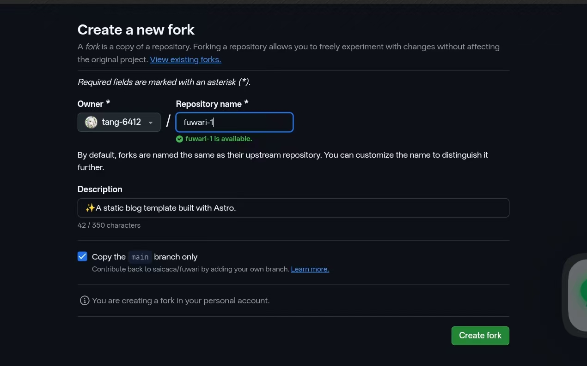
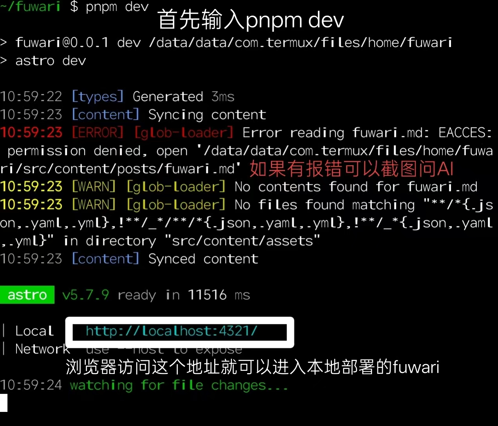
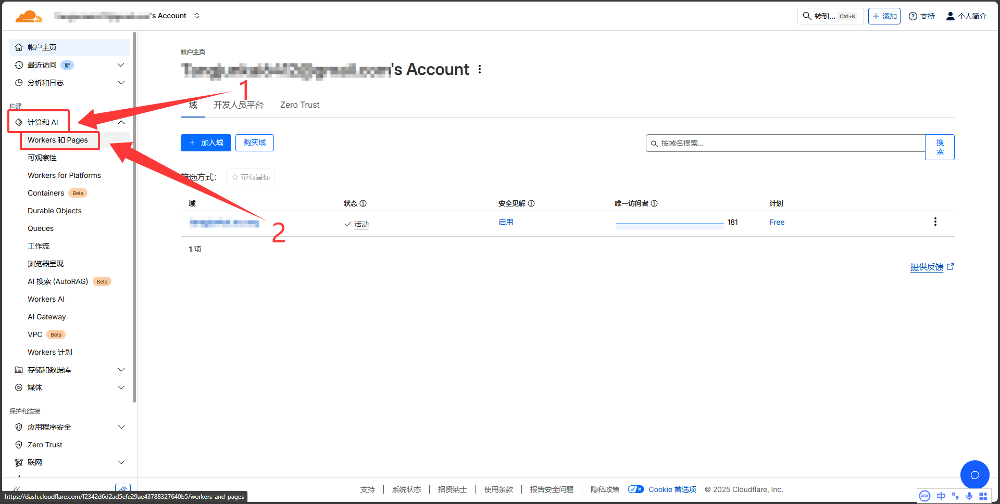
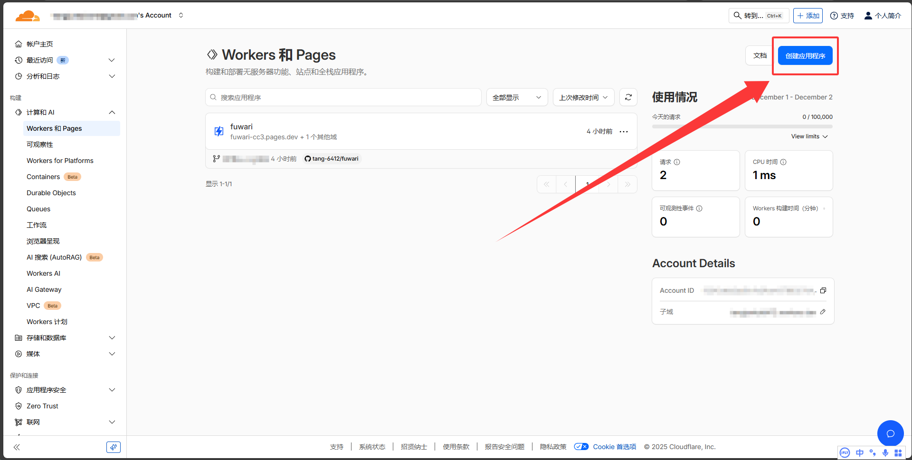
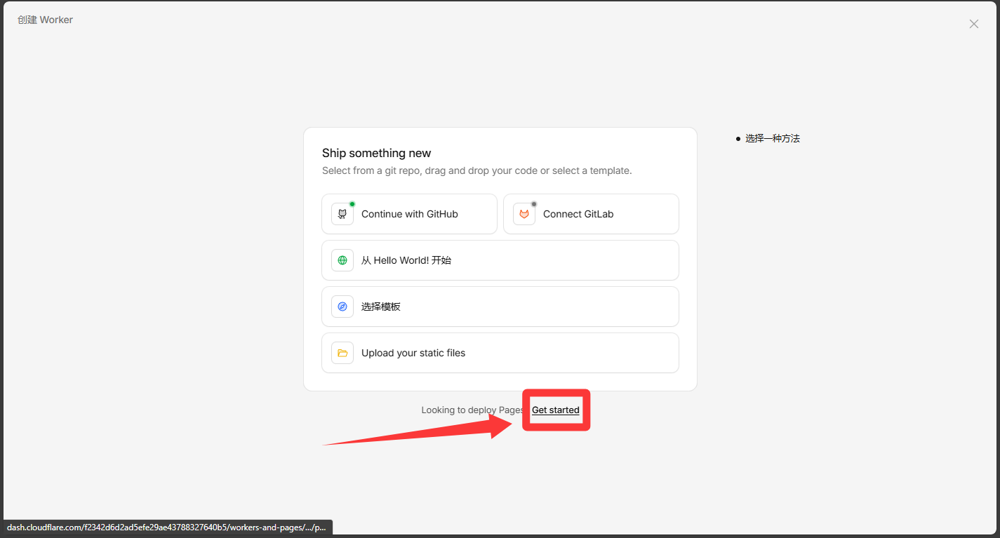
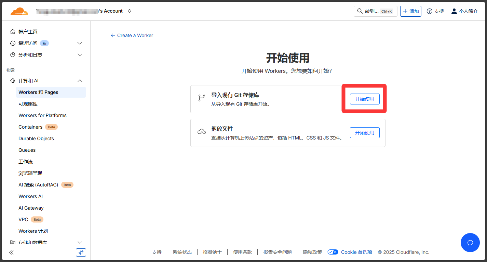
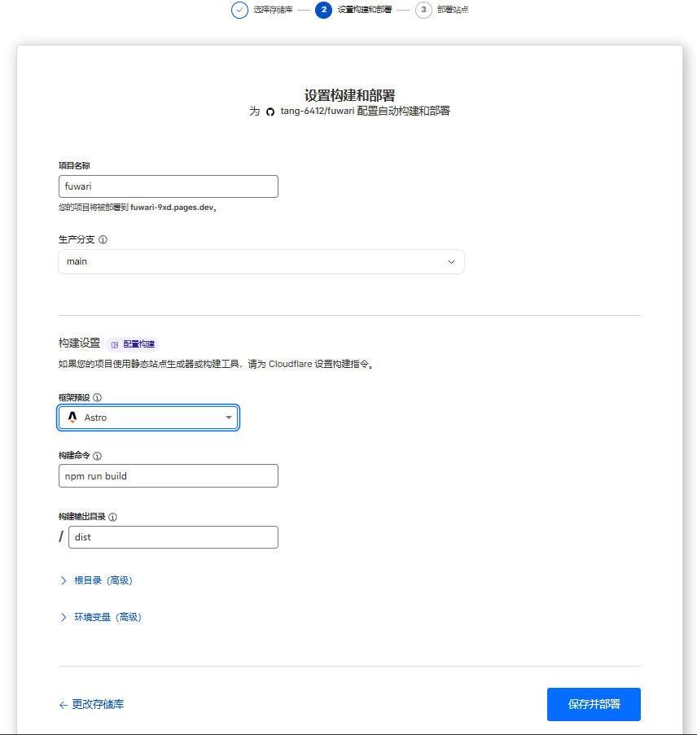

## 你需要准备的东西

- 1. 一个牛逼的脑子，支持多线程运算，遇到问题会思考，不会的会自己查

- 2. 一个AI工具，不懂的可以去问她

- 3. [Node.js — Run JavaScript Everywhere (nodejs.org)](https://nodejs.org/en)：Fuwari是基于Node.js开发的，得先装上它才能搭博客

- 4. 一个[Github](https://github.com)账号：用于创建一个代码仓库来存放Fuwari的文件

- 5. 一个[Cloudflare](https://cloudflare.com)账号：托管网站用的，国内访问也比较顺畅

- 6. [MarkText](https://www.marktext.cc)：这是一个可视化MarkDown编辑器，因为Fuwari的每一篇文章/页面都用了MarkDown，所以需要一个好用的MarkDown编辑器

- 7. 稍微懂点Markdown语法：毕竟Fuwari的文章都是用这个写的，可以参照：[Markdown 基本语法 | Markdown 官方教程](https://markdown.com.cn/basic-syntax/)

- 8. 一个Linux终端：可以方便的预览、拉取和更新你的github上的fuwari仓库。Windows可以用WSL或虚拟机，Android可以用Termux，具体自己查。

### 流程图

本地部署Fuwari，编写文章 -> 推送更改到远程Github仓库 -> Cloudflare Pages / Vercel检测到仓库更新自动构建新的网站静态文件 -> 网站成功更改

### 让我们开始吧！

#### 首先，我们得先本地部署Fuwari

1. Fork仓库：
   
   [https://github.com/saicaca/fuwari](https://github.com/saicaca/fuwari)


仓库名（图2的“fuwari-1”）可以随便写，可以保持默认，最后按右下角那个绿色按钮“Create fork”

2. 然后将仓库克隆到本地：`git clone <你的仓库URL>`（推荐使用SSH，可以不用魔法来推送更改）

3. 首先，全局安装pnpm：`npm install -g pnpm`（如果npm国内拉取过慢，请尝试cnpm：[npmmirror 镜像站](https://npmmirror.com/)）

4. 然后在项目根目录（就是你克隆仓库后多出来的那个文件夹，名字和你先前写的仓库名一样）安装依赖：`pnpm install`  和 `pnpm add sharp`

5. 至此，你成功在本地部署了Fuwari

> [!TIP]
> 
> 你也可以使用创建一个新的空仓库然后手动上传文件，并且可以将仓库可见性设为：Private

#### 改写Fuwari的基本信息并且清理多余文件

> 刚创建的Fuwari可能带有一些示例的博主名，ICON，URL，介绍和示例文章，为了让用户知道这是你的博客，我们需要一一改写

1. 在根目录下的 `src` 文件夹中，你可以找到 `config.ts` 我们来开始改写
   
   - title：你的博客主标题
   
   - subtitle：你的博客副标题。可选，在首页会显示为“主标题 - 副标题”
   
   - lang：博客显示语言。注释已经列出了一些常用的值，如：en, zh_CN, zh_TW, ja, ko
   
   - themeColor：hue值则是你的博客主题色，可以在你的博客右上角的画板图标确定喜欢的颜色再填写
   
   - banner：src：即banner图片，支持本地文件/http/https URL
   
   - favicon：src：即网站图标，支持本地文件/http/https URL
   
   - links：即友情链接，这些链接在导航栏上
   
   - avatar：即你的头像，支持本地文件/http/https URL
   
   - name：即你的名字
   
   - bio：即个性签名，会显示在头像和名字下面
   
   - `NavBarConfig` 为导航栏设置的超链接。`ProfileConfig` 为你的用户的超链接
   
   - icon：你需要前往[icones.js](https://icones.js.org/)去搜索你想要的图标，比如QQ，则填写 `fa6-brands:qq` ，如图。Fuwari默认支持这几种类型：`fa6-brands`, `fa6-regular`, `fa6-solid`, `material-symbols`。可以在 `astro.config.mjs` 中搜索关键字进行配置

2. 清理多余文件。在根目录下的 `src/content/posts` 文件夹中会有一些示例文章，这些文章介绍了一些MarkDown语法和技巧，可以让你更快上手Fuwari和fuwari，我们可以将其保存到别处

3. 至此，你已经可以开始撰写文章了

#### 让我们开始写作！
>推荐使用 黑曜石（Obsidian）

1. 首先，用终端在项目根目录执行：`pnpm new-post <这里填写你的文章标题>`

2. 然后，在根目录下的 `src/content/posts` 文件夹中会多出一个 `xxx.md`文件

3. 我们使用MarkText打开这个文件，你可以看到一些基本信息，我们只需要关注几个重要的信息

4. ```markdown
   title: xxx
   published: 2024-10-14
   description: ''
   image: ''
   tags: []
   categories: ''
   draft: false 
   lang: ''
   ```
   
   - title：文章标题
   
   - published：文章创建时间
   
   - description：文章描述，正常会显示在文章标题下面
   
   - image：文章封面图（同目录需要写 `./` 如：`./myblog/img/封面图.jpg`）
   
   - tag：文章标签
   
   - categories：文章分类

5. 我们还需要更改根目录下的 `astro.config.mjs` 。在第34行更改 `stie:` 为你的站点URL，如： `site: "https://onani.cn",`

6. 欸？有的人就会问了，MarkDown固然好，但是我要如何处理图片的置入呢

7. 这也很简单，多亏了MarkText这款软件，我们也可以像编辑Typecho一样直接使用Ctrl+CV来在MarkDown语法中置入图片，但是我们需要一些小设置：
   
   - 依次点击：MarkText软件的左上角的三条杠 -> File -> Perferences -> 左侧的Image分类 -> 如图设置 -> 注意更改第一个选项为Copy开头的选项，将Perfer开关打开，然后上下两个文本框一个填写绝对路径一个填写相对路径
   
   
   - 这样，当置入图片时，会往 `https://eo-r2.2x.nz/myblog/img` 文件夹复制一份，然后写入MarkDown文件。这样网站就能成功读取到图片啦。而你只需要Ctrl+CV，其他操作MarkText都会自动处理

8. 至此，你已经会用MarkText编写MarkDown语法的文章了

#### 本地预览，然后发布到Github

1. 当你认为你的文章已经写得差不多时，想要看看效果？请到项目根目录执行：`pnpm dev`，稍等片刻，你就可以本地预览你的博客啦

2. 好！接下来我们需要使用Git将我们所做的更改发布到Github
   
   - 首先，你需要让Git知道你是谁：`git config --global user.name "你的Github用户名"`和`git config --global user.email "你的Github邮箱@example.com"`
   
   - 然后，更改远程仓库为ssh*（如果是通过ssh克隆的不用改）：`git remote set-url origin git@github.com:xxx/xxx`
   
   - 随后，让我们提交所有文件：`git add .`
   
   - 之后，让我们发布一个本地提交：`git commit -m "更新描述"`
   
   - 最后，让我们将本地更改提交到远程仓库：`git push`。它会先让你输入用户名，然后让你输入Github Token（不是登录密码）。
2. 此时，你的Github仓库应该已经有了新的提交

### 使用Cloudflare托管你的Fuwari

##### [Cloudflare](https://www.cloudflare.com/zh-cn/)
1. 登陆你的Cloudflare
2. 点击”**计算与AI**“下的**Workers 和 Pages**
3. 点击右上角的==创建应用程序==
4. 点击下方的[Get started]
5. 我们的Fuwari存放在Github仓库，就**点击”导入现有 Git 储存库“旁的开始使用**
6. 登陆好Github后，会要求选择一个储存库。我们就选择存放Fuwari的那个仓库，点击开始设置
7. ”框架预设“中选择`Astro`，构建命令输入`pnpm build`。最后点击右下角的”保存并部署“，就会自动开始部署。如果有报错，复制日志给AI取得解决方法。
8. 稍等一会儿，你的Fuwari就部署好了！他会给你一个`pages.dev`结尾的域名，访问它就可以进入你的网站了，绑定自定义域，即可通过自定义域访问！
9. 随后，你只需要在本地编写文章，然后使用Git将更改推送到远程仓库，Cloudflare就会自动部署，更新你的博客！

本文参考了[Fuwari静态博客搭建教程 - AcoFork Blog](https://2x.nz/posts/fuwari/)

